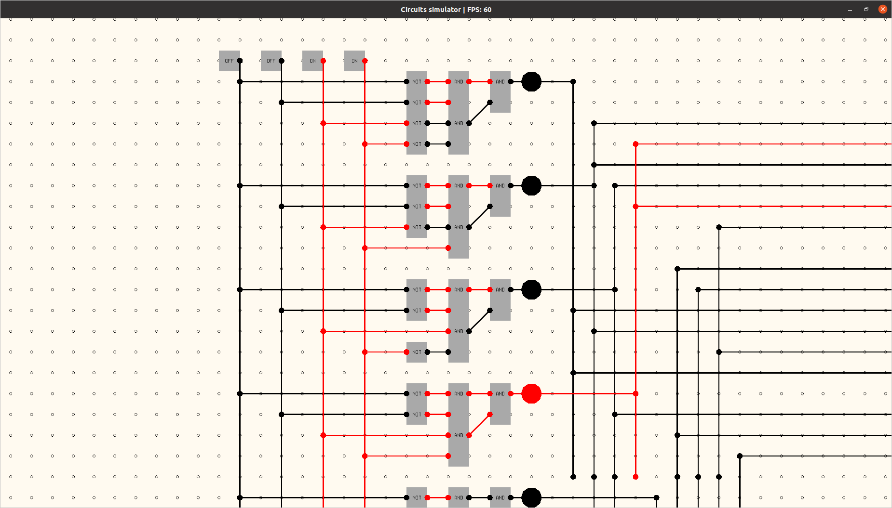

# simDC
**Sim**ulator for **D**igital **C**ircuits on a infinite circuit board.

Inspired by [SICP 3.3.4](https://bunyk.github.io/posts/sicp3.3.4) and [Sebastian Lague](https://www.youtube.com/watch?v=QZwneRb-zqA).

Made in Golang using [Pixel for graphics](https://github.com/faiface/pixel). This project is just a PoC, so has some bugs and weird UI design. If you see something that could be improved - feel free to send a PR or create a ticket.

## Usage

To open a circuit, run it with json file of circuit as a first parameter. 

You could move across space with arrow keys and zoom using mouse wheel. All the components have inputs on the left and outputs on the right. To delete wires or other component use scissors tool to cut across them.

## Roadmap 

Nice to have in the future in no particular order:

- Optimize drawing, so FPS does not drop so much on big circuits
- Select, copy, move
- Better shapes for gates so they are easily distinguishable when small
- Adding a custom text labels, to help with understanding circuits
- Toolbar with icons instead of keyboard
- New elements like flip-flops, buttons & LED display, so you could build a calculator or something
- A way to "integrate" circuit into custom chips
- Levels & challenges to make this more like a game.

Or maybe I'll buy myself a [Turing Complete](https://store.steampowered.com/app/1444480/Turing_Complete/) game and give up on this project.
